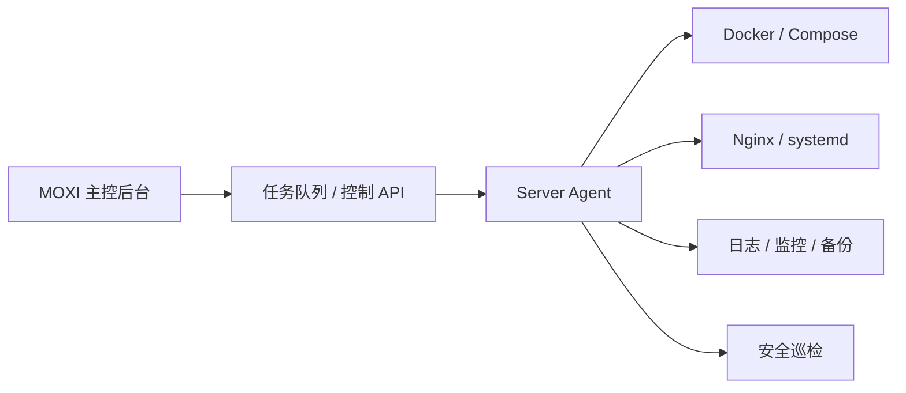

# MOXI Server Agent 架构设计

## 背景

MOXI 后续可能会同时管理多个服务器：中转站、用户端、管理端、WarmStudy、Hermes、数据库、缓存、监控服务等。单台服务器手动 SSH 维护可以应急，但不适合长期商用和托管部署。

MOXI Server Agent 的目标是让每台服务器变成“可被主控安全管理的节点”。

## 总体架构

## 组件说明

### 主控后台

主控后台负责展示服务器列表、服务状态、部署按钮、任务记录、报警信息和审计日志。

主控后台不应该直接保存服务器 root 密码。推荐保存服务器节点 ID、Agent 公钥指纹、最近心跳、运行状态和可执行任务类型。

### Server Agent

Agent 运行在每台服务器上，建议以 systemd 服务常驻。

Agent 默认采用“主动出站连接”模式：服务器主动连接主控，避免额外开放公网管理端口。

### 任务系统

任务应使用白名单动作，而不是任意 shell 命令。

推荐动作：

- `deploy_project`
- `restart_service`
- `reload_nginx`
- `check_health`
- `backup_database`
- `rotate_logs`
- `upgrade_agent`
- `collect_metrics`

### 运行环境

推荐基础系统：

- Ubuntu Server 22.04 LTS / 24.04 LTS
- Debian 12
- OpenCloudOS

推荐基础组件：

- Docker + Docker Compose
- Nginx
- Redis
- PostgreSQL
- Fail2ban
- UFW 或 firewalld

## 自定义镜像方案

不要魔改 Linux 内核。推荐在标准系统上预装 Agent 与依赖，然后保存成云厂商自定义镜像。

镜像内置：

- Docker / Compose
- Nginx
- Agent systemd 服务
- 日志目录
- 安全基线
- 自动注册脚本

镜像不内置：

- 私钥
- 固定 token
- 数据库密码
- 生产证书
- 真实服务器地址

## 注册流程

1. 服务器首次启动。
2. cloud-init 或安装脚本启动 Agent。
3. Agent 读取一次性注册 token。
4. Agent 向主控发起注册。
5. 主控返回节点 ID 和短期凭证。
6. Agent 写入本机配置并开始心跳。
7. 主控后台显示新服务器待确认。

## 数据流

Agent 上报：

- 心跳
- 资源指标
- 服务状态
- 任务执行结果
- 关键日志摘要

主控下发：

- 白名单任务
- 配置变更
- 部署指令
- Agent 升级指令

